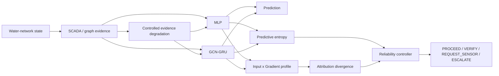
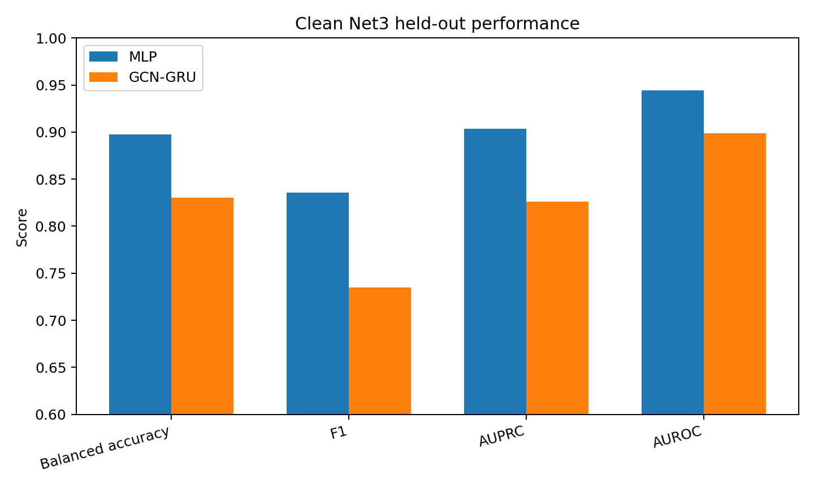
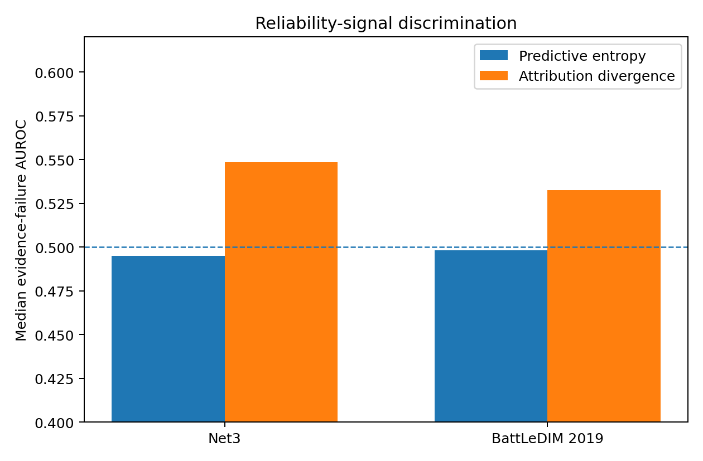
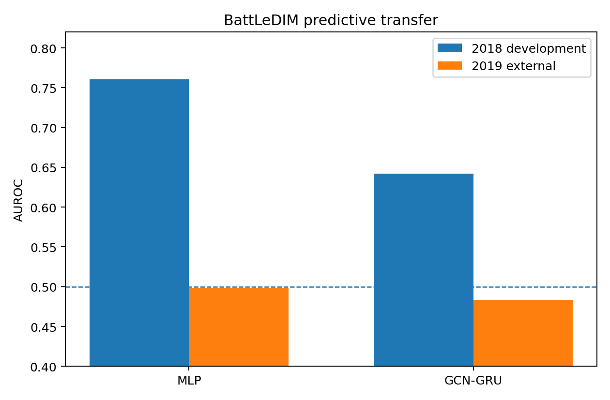

# Water-Network AI Reliability Under Evidence Degradation and Domain Transfer

This repository studies reliability in water-network machine-learning systems when the available evidence is incomplete, corrupted, stale, conflicting, or structurally wrong, and when a model is transferred to a different operating year.

The project has two parts:

1. a controlled WNTR/EPANET Net3 experiment with frozen evidence degradations; and  
2. a separate BattLeDIM/L-Town external evaluation using 2018 for development and 2019 as the held-out evaluation year.

The main question is not whether a GNN can detect leaks. It is:

> **Which reliability signals remain useful when the evidence available to a model degrades, and where do those mechanisms stop helping when the predictive model itself fails under domain transfer?**

## Experiment overview



The controlled Net3 benchmark includes missing pressure sensors, sensor noise, persistent bias, stale readings, topology mismatch, and matched cross-source conflict. Model, corruption, attribution, reconstruction, threshold, and controller rules were frozen before the final degraded held-out evaluation.

## Controlled Net3 result

The held-out Net3 test contains 30 physical contexts and 2,700 windows. Test leak locations were unseen during training.

| Metric | MLP | GCN-GRU |
| --- | ---: | ---: |
| Balanced accuracy | **0.8973** | 0.8302 |
| F1 | **0.8359** | 0.7352 |
| AUPRC | **0.9037** | 0.8260 |
| AUROC | **0.9443** | 0.8988 |
| Brier | **0.0571** | 0.0789 |

The MLP was stronger than the frozen GCN-GRU on this benchmark. I did not retune the graph model after seeing the held-out result.



## Reliability signals under controlled degradation

Predictive entropy was poorly aligned with evidence degradation. Across the held-out degradation conditions, its median evidence-failure AUROC was **0.4950**.

Input×Gradient attribution-profile divergence was more informative in most matched conditions:

- attribution-divergence AUROC > entropy AUROC in **27/33** conditions;
- median attribution-divergence AUROC: **0.5485**;
- maximum: **0.9787**.

This is not a claim that attribution divergence is a strong universal detector. Several conditions remained close to chance.



## Missing-sensor recovery was architecture dependent

The same frozen training-only Ridge reconstruction helped the MLP but increasingly harmed the GCN-GRU.

| Missingness | MLP accuracy change | GCN-GRU accuracy change |
| --- | ---: | ---: |
| Low | **+0.2215** | -0.0193 |
| Medium | **+0.1300** | -0.1322 |
| High | **+0.1130** | -0.2222 |

The experiment therefore does not support a general claim that sensor reconstruction improves reliability.

## Reliability controller

The controller combines predictive entropy and attribution divergence using thresholds fixed from clean calibration data.

On degraded Net3 attribution-subset windows:

| Model | Proceed rate | Unsafe proceed |
| --- | ---: | ---: |
| MLP | 0.8249 | 0.1701 |
| GCN-GRU | 0.7751 | 0.0797 |

`unsafe proceed` means that the final action is `PROCEED` and the final prediction is incorrect.

For missing-sensor cases, reconstruction occurs before the final controller action. The raw degraded error, post-reconstruction forced error, and unsafe-proceed rate are reported separately in [`report/reproducibility_check.md`](report/reproducibility_check.md).

## External BattLeDIM/L-Town evaluation

The external study was frozen separately. The 2018 data were used for development, then 2019 was opened once for the final evaluation.

The original `any active leak` target was rejected before model training because it was positive for almost all of 2018. The external task was therefore fixed prospectively as **recent leak-onset detection**: whether at least one new leak onset occurred during the previous 24 hours.

Predictive transfer failed:

| Model | 2018 development AUROC | 2019 external AUROC | 2019 external AUPRC |
| --- | ---: | ---: | ---: |
| MLP | 0.7603 | **0.4981** | **0.0534** |
| GCN-GRU | 0.6422 | **0.4834** | **0.0534** |

I kept this result unchanged. There was no post-2019 architecture change, threshold search, target change, or retraining.

A read-only transfer analysis found substantial 2018→2019 covariate shift:

- **32/37** SCADA features had PSI >= 0.25;
- median PSI: **0.7493**;
- median KS statistic: **0.3553**.



The external result is a boundary condition for the project: evidence-monitoring mechanisms can still react to degraded inputs, but they cannot make an end-to-end system reliable when the base predictor itself no longer discriminates in the target domain.

## What I take from the experiment

The results separate two different reliability problems:

**Evidence failure**  
The model may receive missing, noisy, stale, biased, conflicting, or structurally incorrect evidence.

**Predictive transfer failure**  
The evidence can be valid while the learned decision rule no longer transfers to the target operating distribution.

The controlled study mainly addresses the first problem. The BattLeDIM result shows why the second problem cannot be ignored.

## Reproduce

The repository preserves the experiment as a sequence of frozen checkpoints rather than a single notebook.

```bash
python -m pip install -r requirements.txt
python tools/verify_repository.py
```

The full execution order is documented in [`REPRODUCIBILITY.md`](REPRODUCIBILITY.md).

Important entry points:

- `protocols/net3/` — controlled-study protocol freezes;
- `src/net3/` — Net3 generation, training, degradation, attribution, controller, and final evaluation;
- `protocols/battledim/` — external-validation protocol freeze;
- `src/battledim/` — BattLeDIM discovery, training, final evaluation, and post-hoc transfer diagnostic;
- `results/net3/` — frozen Net3 outputs used for the reported results;
- `results/battledim/` — external-validation summaries available in this snapshot;
- `report/` — method, results, failure analysis, limitations, claim boundaries, and reproducibility check;
- `results/` — frozen Net3 artifacts, external-validation summaries, and compact result tables.
- `outputs/verification/` — machine-readable post-experiment verification records.

## Reproducibility record

The Net3 result was independently recomputed from the frozen raw prediction and controller files after the experiment. The check covered split isolation, held-out metrics, corruption counts, attribution accounting, reconstruction results, controller actions, thresholds, and claim boundaries.

The result of that check is reported in plain research language in [`report/reproducibility_check.md`](report/reproducibility_check.md). The machine-readable recomputation is preserved separately.

## Limitations

This is a controlled simulation study plus a retrospective benchmark transfer experiment. It does not establish field performance, state-of-the-art leak detection, or a general result about GNNs. The external transfer analysis is descriptive and does not establish that covariate shift caused the 2019 predictive failure.

See [`report/limitations.md`](report/limitations.md) and [`report/claim_boundaries.md`](report/claim_boundaries.md).

## Data

Large upstream data are not redistributed here. Net3 is obtained through WNTR. BattLeDIM/L-Town data should be obtained from the original benchmark source.

See [`DATA.md`](DATA.md).

## Citation

See [`CITATION.cff`](CITATION.cff).
